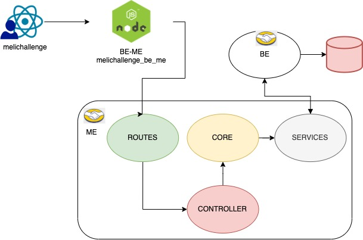

# BUILD & RUN BACKEND MIDDLE END MELI CHALLENGE PROYECT!

depedencies to install

- Node v20.11.0 
- npm 10.2.4

To deploy and run melichallenge_be_me proyect you should type on your terminal:

    $ git clone https://github.com/EVELYN2717/melichallenge_be_me.git
    $ cd melichallenge_be_me
    $ npm i
    $ npm start

You can test the API with those cURL:

# Resource to get detail item by id

    $ curl --location 'http://localhost:3001/api/items/MLA1579172896'

# Resource to get search at item list by query

    $ curl --location 'http://localhost:3001/api/items?q=MLA412445'

# Solution

